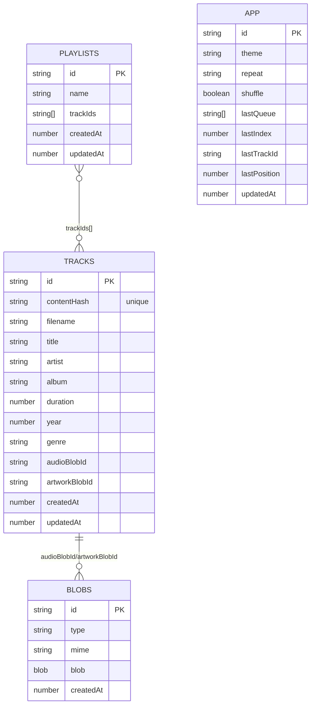

# Local Music (Spotify‑style) — Offline‑First PWA

An **offline-first local music web app** you can deploy to **Vercel**. Users upload MP3s, the app extracts **ID3 metadata + album art** in the browser, stores everything in **IndexedDB**, and provides a “Spotify-style” UX:

- **Upload** (`/upload`): drag & drop import + progress + dedupe by content hash  
- **All Songs** (`/songs`): search + sort + multi-select + add to queue/playlists  
- **Playlists** (`/playlists`): CRUD + playlist detail with drag-and-drop reordering  
- **Now Playing** (`/now-playing`): player controls + scrubbing + queue drawer  

## Screenshots (placeholders)

- Upload page: *(add screenshot)*  
- Songs page: *(add screenshot)*  
- Playlist detail (DnD reorder): *(add screenshot)*  
- Now Playing + Queue: *(add screenshot)*  

## Stack

- **React + Vite + TypeScript**
- **Tailwind CSS** (theme via CSS variables; dark/light/system)
- **Dexie** (IndexedDB)
- **music-metadata-browser** (ID3 parsing in browser)
- **Media Session API** (lockscreen/hardware controls where supported)
- **Workbox (via `vite-plugin-pwa`)** + custom SW route that streams blobs from IndexedDB
- **React Router**
- **@dnd-kit** for accessible drag-and-drop reorder

## How it works (offline + blobs)

Tracks are stored as metadata in IndexedDB, while audio/artwork binaries are stored as blobs in a separate table.

To make offline playback resilient, the service worker exposes a **virtual URL**:

- `/_idb/blob/:id` → service worker fetch handler → reads `blobs` store in IndexedDB → returns the Blob

So `<audio src="/_idb/blob/...">` and `` keep working **after offline reloads**, without relying on in-memory `blob:` URLs.

## Data model

### Tables

- `tracks`: metadata + pointers to blobs
- `blobs`: `{ id, type: 'audio'|'artwork', mime, blob }`
- `playlists`: `{ id, name, trackIds[] }`
- `app`: settings + last session state (queue, position)

### Diagram (Mermaid)



## Local development

```bash
npm install
npm run dev
```

Open the dev server (usually `http://localhost:5173`).

### Dev-only demo seed

On `/upload` in dev, click **“Seed demo (dev)”** to create a tiny sample library (for UI testing without real MP3s).

## Build & preview (PWA testing)

PWA behavior is best tested on a production build:

```bash
npm run build
npm run preview
```

Then:

- Open the preview URL in Chrome
- Use “Install app” from the address bar (or menu)
- In DevTools → Application:
  - Service Workers: verify active/controlling
  - Storage → IndexedDB: confirm `local-music-db`

### Offline test steps

1. Visit `/upload` once online (to cache the app shell)
2. Upload a couple of MP3s
3. Turn on “Offline” in DevTools → Network
4. Reload `/songs` and `/now-playing`  
   - Songs list should still render
   - Previously imported tracks should still play

If it’s your first-ever visit and you start offline, you’ll see `public/offline.html`.

## Backup / export / import

From `/playlists`:

- **Export JSON**: exports tracks metadata + playlists + settings (**no audio blobs**)
- **Import JSON**: restores playlists and re-links tracks **only if the referenced audio blob is still present** in your browser’s IndexedDB

This “metadata-first” approach is portable and safe, but audio blobs can’t be restored without re-uploading (unless you implement a zip export).

## Deploy to Vercel (SPA)

1. Push this repo to GitHub
2. In Vercel: **New Project → Import**
3. Framework preset: **Vite**
4. Build command: `npm run build`
5. Output dir: `dist`

SPA routing is handled by `vercel.json` (rewrites all routes to `index.html`).

## Known limitations

- **Browser storage quota**: IndexedDB space varies by browser/device. Large libraries may hit quota; the app will show errors on failed writes.
- **iOS Safari**: PWA/service worker support exists, but storage and background audio behavior can be finicky and more constrained than desktop Chrome.
- **Shuffle toggling**: this app “shuffles in place” (it keeps the current track and randomizes the rest). It does not preserve an original unshuffled order.
- **Export without blobs**: export/import is metadata-first; blobs aren’t bundled.

## Acceptance test checklist

Run these manual steps to validate the full flow:

1. **Upload → Songs appear**
   - Go to `/upload`
   - Drop a few MP3s
   - Confirm they appear in `/songs` with correct title/artist/album/duration
   - Confirm embedded artwork shows (if present); placeholder if not
2. **Queue + playback**
   - In `/songs`, select multiple tracks → “Add to queue”
   - Start playback (click a song)
   - Open/close queue drawer
   - Drag to reorder queue
3. **Playlists**
   - Create a playlist in `/playlists`
   - In `/songs`, select tracks → add to playlist
   - Open playlist detail page → drag reorder → remove a track
4. **Offline**
   - Build + preview
   - Play a track once
   - Toggle DevTools “Offline”
   - Reload `/songs` and play the same track again (should work)

## Key files

```
index.html
vite.config.ts
tailwind.config.ts
vercel.json
public/
  manifest.webmanifest
  offline.html
  icons/
src/
  App.tsx
  main.tsx
  router.tsx
  sw.ts
  types.ts
  db/indexedDb.ts
  lib/id3.ts
  lib/hash.ts
  lib/audio.ts
  hooks/usePlayer.tsx
  hooks/useIndexedDb.ts
  pages/Upload.tsx
  pages/Songs.tsx
  pages/Playlists.tsx
  pages/PlaylistDetail.tsx
  pages/NowPlaying.tsx
  components/
```

